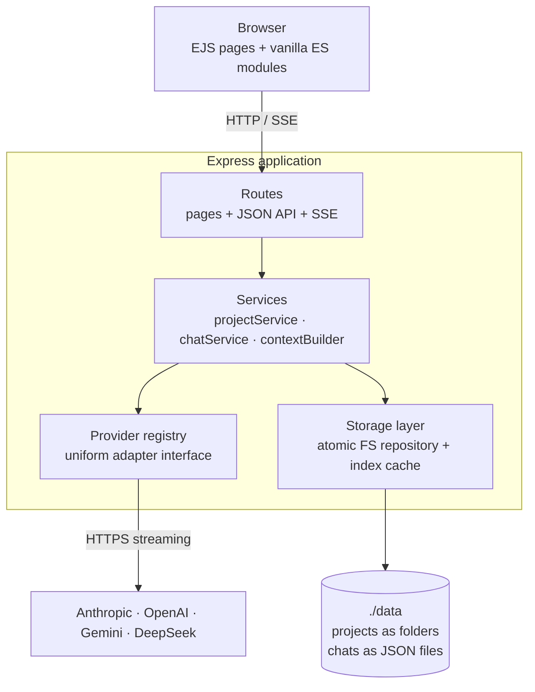
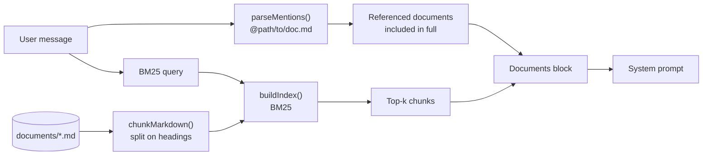
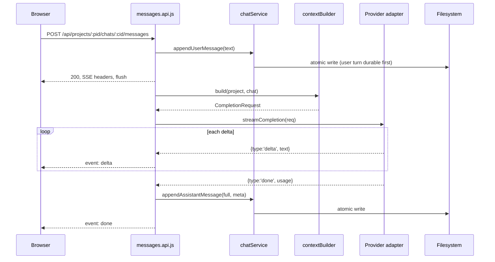

# Architecture — LLM Project Desktop

**Status:** Draft v1
**Companion to:** [PRD.md](./PRD.md)
**Last updated:** 2026-09-11

---

## 1. Architectural principles

1. **The filesystem is the database.** No SQLite, no ORM. A project is a directory; a chat
   is a JSON file. Anything the app knows, `cat` can tell you too.
2. **Providers are plugins.** Every LLM sits behind one narrow interface. Routes, storage,
   and UI never name a vendor.
3. **Server renders, client enhances.** HTML arrives complete from the server. Client JS
   handles streaming and composer ergonomics only. Turn JS off and you can still read
   everything.
4. **Context is composed at send time.** Nothing is denormalised into chat files. The
   project description is read fresh on every turn, so editing it takes effect immediately.
5. **Durability over throughput.** Single user, low concurrency. Always prefer the atomic,
   obvious write to the clever fast one.

## 2. Stack

| Layer | Choice | Why |
|-------|--------|-----|
| Runtime | Node.js 20 LTS | Native `fetch`, stable `fs/promises`, no transpiler |
| Server | Express 5 | Explicitly requested; small and well understood |
| Templates | EJS | Plain HTML with interpolation; no JSX, no build step |
| Client JS | Vanilla ES modules, served as-is | No React, no bundler |
| Markdown | `marked` + `dompurify` | Render assistant output safely |
| Styling | Hand-written CSS with custom properties | Light/dark via tokens; no framework |
| Config | `dotenv` | Keys from `.env` |
| Provider calls | `nooblyjs-ai-common` (plain `fetch`) | Shared with the other nooblyjs AI projects; no vendor SDKs. Gemini and DeepSeek use the OpenAI-compatible adapter |
| Tests | `node:test` + `supertest` | Built-in runner; no Jest |

Deliberately absent: React, Vite/webpack, TypeScript, Tailwind, any database driver.

## 3. System overview



Strict layering: routes never touch the filesystem, services never speak HTTP to a vendor,
adapters never touch disk.

## 4. Directory layout

### 4.1 Source tree

```
/
├── server.js                   # bootstrap: env, app, listen
├── src/
│   ├── app.js                  # express app assembly (exported for tests)
│   ├── config/
│   │   ├── index.js            # env parsing, defaults, DATA_DIR resolution
│   │   └── models.js           # curated model catalogue per provider
│   ├── routes/
│   │   ├── pages.js            # GET  html pages
│   │   ├── projects.api.js     # CRUD /api/projects
│   │   ├── chats.api.js        # CRUD /api/projects/:id/chats
│   │   ├── messages.api.js     # POST message -> SSE stream
│   │   ├── documents.api.js    # documents tree, CRUD, move
│   │   └── settings.api.js     # provider status, defaults
│   ├── services/
│   │   ├── projectService.js
│   │   ├── chatService.js
│   │   ├── contextBuilder.js   # system prompt + history windowing
│   │   └── titleService.js     # derive chat title from first message
│   ├── providers/
│   │   ├── registry.js         # discovery, availability, resolution
│   │   ├── anthropic.js
│   │   ├── openai.js
│   │   ├── gemini.js
│   │   ├── deepseek.js         # openai client, different baseURL
│   │   └── types.js            # jsdoc typedefs for the adapter contract
│   ├── storage/
│   │   ├── fsRepository.js     # atomic read/write/list/delete primitives
│   │   ├── paths.js            # id -> path, with traversal guards
│   │   ├── writeQueue.js       # serialise writes per file
│   │   └── index.js            # in-memory project index + invalidation
│   ├── lib/
│   │   ├── ids.js              # slug + suffix generation
│   │   ├── tokens.js           # approximate token counting
│   │   ├── textIndex.js        # markdown chunking + BM25
│   │   ├── errors.js           # AppError taxonomy
│   │   └── logger.js
│   └── middleware/
│       ├── errorHandler.js
│       └── validate.js
├── views/                      # EJS
│   ├── layout.ejs
│   ├── projects.ejs
│   ├── project.ejs
│   ├── chat.ejs
│   └── partials/
├── public/
│   ├── css/app.css
│   └── js/
│       ├── chat.js             # SSE consumption, transcript rendering
│       ├── projects.js         # create/edit/delete interactions
│       └── lib/markdown.js
├── test/
└── data/                       # gitignored by default; user data
```

### 4.2 Data tree

```
data/
├── settings.json
└── projects/
    ├── nmea-parser-a3f9/
    │   ├── project.json
    │   ├── chats/
    │   │   ├── 20260911T0912-parse-rmc-k2m8.json
    │   │   └── 20260910T1440-checksum-bug-p7qz.json
    │   └── documents/
    └── quarterly-report-b81c/
        ├── project.json
        └── chats/
```

Chat filenames are `<UTC timestamp>-<title slug>-<suffix>.json`, so a directory listing is
chronological and readable. The authoritative ID is the `id` field inside the file; the
filename is a convenience. The loader tolerates a renamed file as long as `id` is intact.

## 5. Data model

### 5.1 `project.json`

```jsonc
{
  "id": "nmea-parser-a3f9",
  "name": "NMEA Parser",
  "description": "A Rust CLI that parses NMEA 0183 sentences...",
  "defaults": {
    "provider": "anthropic",      // null => fall back to global settings
    "model": "claude-sonnet-5",
    "temperature": 0.7,
    "maxOutputTokens": 4096
  },
  "createdAt": "2026-09-11T09:12:03.114Z",
  "updatedAt": "2026-09-11T09:40:51.002Z",
  "schemaVersion": 1
}
```

### 5.2 Chat file

```jsonc
{
  "id": "20260911T0912-parse-rmc-k2m8",
  "projectId": "nmea-parser-a3f9",
  "title": "Parsing RMC sentences with a zero checksum",
  "titleGenerated": true,          // false once the user renames it
  "provider": "anthropic",
  "model": "claude-sonnet-5",
  "createdAt": "2026-09-11T09:12:03.114Z",
  "updatedAt": "2026-09-11T09:31:20.771Z",
  "schemaVersion": 1,
  "messages": [
    {
      "id": "m_01",
      "role": "user",
      "content": "Why does my checksum validation reject valid RMC sentences?",
      "createdAt": "2026-09-11T09:12:03.114Z"
    },
    {
      "id": "m_02",
      "role": "assistant",
      "content": "Because the XOR must exclude the leading `$`...",
      "createdAt": "2026-09-11T09:12:09.550Z",
      "meta": {
        "provider": "anthropic",
        "model": "claude-sonnet-5",
        "inputTokens": 812,
        "outputTokens": 240,
        "latencyMs": 6436,
        "finishReason": "end_turn",
        "truncatedHistory": false
      }
    }
  ]
}
```

`role` is `user` or `assistant`. System content is never stored — it is composed per
request from the live project description (FR-6).

A failed turn stores an assistant message with `meta.error` set and `content` holding the
user-facing error text, so the transcript reflects what actually happened.

### 5.3 `settings.json`

```jsonc
{
  "defaultProvider": "anthropic",
  "defaultModel": "claude-sonnet-5",
  "temperature": 0.7,
  "maxOutputTokens": 4096,
  "schemaVersion": 1
}
```

No API keys. Keys live in the environment only (FR-13).

## 6. Storage layer

### 6.1 Atomic writes

Every write goes through:

1. Serialise to JSON with two-space indentation.
2. Write to `<target>.tmp-<pid>-<rand>` in the same directory.
3. `fsync` the temp file.
4. `rename` over the target — atomic within a filesystem.

A crash therefore leaves either the previous complete file or the new complete file.

### 6.2 Write serialisation

`writeQueue.js` keeps a promise chain keyed by absolute path. Concurrent writes to one
chat run in order instead of interleaving. Different files proceed in parallel.

### 6.3 Path safety

`paths.js` is the only module that builds filesystem paths. Every ID is validated against
`/^[a-z0-9]+(?:-[a-z0-9]+)*$/` before use, the resolved path is checked to be inside
`DATA_DIR`, and any failure throws `ValidationError`. No route concatenates a path itself.

### 6.4 Index cache

Listing projects means reading N `project.json` files. `storage/index.js` caches a
lightweight record per project (id, name, description excerpt, chat count, updatedAt),
invalidated by `fs.watch` on `data/projects` and by every write through the repository.
On watch failure it degrades to a 5-second TTL. Chat message bodies are never cached —
they are read on demand.

## 7. Provider abstraction

### 7.1 The contract

Every adapter exports:

```js
/**
 * @typedef {Object} ProviderAdapter
 * @property {string} id                      // 'anthropic'
 * @property {string} label                   // 'Anthropic Claude'
 * @property {string} apiKeyEnvVar            // 'ANTHROPIC_API_KEY'
 * @property {() => boolean} isConfigured
 * @property {() => ModelInfo[]} listModels
 * @property {(req: CompletionRequest) => AsyncIterable<StreamEvent>} streamCompletion
 */

/**
 * @typedef {Object} CompletionRequest
 * @property {string} system
 * @property {{role: 'user'|'assistant', content: string}[]} messages
 * @property {string} model
 * @property {number} temperature
 * @property {number} maxOutputTokens
 * @property {AbortSignal} signal
 */

/**
 * StreamEvent is one of:
 *   { type: 'delta', text: string }
 *   { type: 'done',  usage: {inputTokens, outputTokens}, finishReason: string }
 *   { type: 'error', error: { code, message, retryable } }
 */
```

Async iterators are the unifying primitive: each provider's stream is adapted into this
one shape, so `messages.api.js` has a single code path regardless of vendor.

### 7.2 Per-provider notes

All four go through nooblyjs-ai-common's provider layer; `src/providers/adapter.js` turns its
events into the contract above. (Until Phase 3b of the common roadmap each had its own SDK.)

| Provider | Common adapter | System prompt | Notes |
|----------|----------------|---------------|-------|
| Anthropic | `anthropic` (Messages API) | top-level `system`, prompt-cached | usage on `message_start` / `message_delta`; no server-side fallbacks |
| OpenAI | `openai-chat` (Chat Completions) | a `system` role message prepended | `stream_options.include_usage`; chosen over the Responses API so `OPENAI_BASE_URL` gateways keep working |
| Gemini | `openai-chat` at Gemini's OpenAI-compatible endpoint | as OpenAI | `max_tokens` rather than `max_completion_tokens` |
| DeepSeek | `openai-chat`, `https://api.deepseek.com` | as OpenAI | `max_tokens` |

One adapter factory serves all four, which keeps FR-16 honest.

### 7.3 Registry

`registry.js` holds the adapter array, and resolves a request to a concrete
`(adapter, model)` by precedence:

```
explicit request  →  project.defaults  →  settings.json  →  first configured provider
```

If the resolved provider has no key, resolution fails with a `ProviderUnavailableError`
that names the missing environment variable.

### 7.4 Model catalogue

`config/models.js` is data, not logic:

```js
{
  anthropic: [
    { id: 'claude-opus-5',   label: 'Opus 5',   contextWindow: 200000 },
    { id: 'claude-sonnet-5', label: 'Sonnet 5', contextWindow: 200000 }
  ],
  // ...
}
```

Adding a model is a one-line edit. `contextWindow` feeds the truncation budget.

## 7A. Documents and retrieval

### Storage

`data/projects/<id>/documents/` holds markdown files in whatever folder structure the user
creates. There is deliberately **no index file and no metadata sidecar**: the filename is
the title, the directory layout is the structure, and the mtime is the version. A document
edited in the user's own editor is therefore indistinguishable from one edited in the app —
which is the point of storing them as files at all.

A move or rename is a single `fs.rename`, so moving a folder carries its subtree atomically.

### Path safety

Document paths are nested and fully user-controlled, so they get more scrutiny than ids:

1. Each segment must pass `assertSegment` — 1–100 chars, no leading dot, no
   `< > : " / \ | ? *` or control characters. This is *safety* and applies to every
   operation, including reads and deletes.
2. Creating or renaming additionally requires `assertCreatableSegment` — no trailing space
   or dot, no Windows reserved names. These are *portability* rules and deliberately do
   **not** apply to existing files, so a file already on disk can always be listed and
   deleted even if the app would not have created it.
3. The joined path is resolved and asserted inside the project's `documents/` directory.
4. Before any read or write, `fs.realpath` is compared against the real documents root.
   A symlink inside the tree pointing outside it is caught here, which the lexical check
   in step 3 cannot see. Symlinks are also omitted from listings.

### Retrieval



**Chunking** splits on markdown headings first, so chunks follow the author's own
structure, then packs oversized sections on paragraph boundaries toward ~1200 characters.
The heading is repeated into the token stream so a section title carries matching weight.

**Scoring** is BM25 (k1 = 1.5, b = 0.75) over a stopword-filtered, crudely singularised
token stream.

**Index lifecycle.** One index per project, held in memory, keyed by a *fingerprint* of the
documents on disk (path, size, mtime) rather than invalidated by an explicit call. This
costs one `readdir` + `stat` per request and buys correctness when files change outside the
app — the alternative would silently serve a stale index to anyone editing in their editor.

**Budget.** Documents get at most `DOCUMENT_BUDGET_SHARE` (40%) of the usable window.
Referenced documents are filled first and truncated if one alone exceeds the budget;
retrieved chunks fill the remainder. The project description is never displaced.

**Failure is non-fatal.** A retrieval error is logged and the turn proceeds as a plain chat.

### Why lexical, not embeddings

| | Lexical (BM25) | Embeddings |
|---|---|---|
| Provider coupling | None | Anthropic has no embeddings API, so OpenAI becomes a hard dependency |
| Cost | Zero | Per-document embedding calls, repeated on every edit |
| Infrastructure | In-memory | A vector store, contradicting "no database" |
| Offline | Works | Needs network |
| Match quality | Lexical overlap only | Semantic |

The deciding factor is the first row: an app whose reason to exist is provider choice
should not require one specific provider to search your own files. `@` references give a
deterministic escape hatch when lexical matching misses.

## 8. Context composition

`contextBuilder.js` turns a project plus a chat into a `CompletionRequest`. It is a pure
function — no I/O — which makes it the most testable part of the system.

```
system = APP_PREAMBLE
       + "\n\n# Project: " + project.name
       + "\n\n" + project.description        // omitted when empty

messages = fitToBudget(chat.messages + newUserMessage)
```

**Budget.** `available = contextWindow − estimate(system) − maxOutputTokens − SAFETY(1024)`.
Token estimation is `ceil(chars / 3.6)` — deliberately conservative, no tokeniser
dependency. Messages are taken newest-first until the budget is exhausted, then reversed;
the pairing is kept intact so the sequence never starts with an assistant turn. If anything
was dropped, `truncatedHistory: true` is returned and the UI shows a banner (FR-10). The
system block is never trimmed.

## 9. Request flow: sending a message



The user's message is persisted **before** the provider is called (FR-9), so a provider
failure or a server crash can never lose it.

**Abort.** The browser closing the connection fires `req.on('close')`, which triggers an
`AbortController` passed to the adapter. Partial text accumulated so far is still saved,
flagged `finishReason: 'aborted'`.

### SSE framing

`POST` cannot be consumed by `EventSource`, so the client uses `fetch()` and reads
`response.body` through a `TextDecoderStream`, parsing events itself. Event types:

| Event | Payload |
|-------|---------|
| `meta` | `{provider, model, truncatedHistory}` — sent first |
| `delta` | `{text}` |
| `done` | `{messageId, usage, finishReason}` |
| `error` | `{code, message}` |

Headers: `Content-Type: text/event-stream`, `Cache-Control: no-cache`,
`X-Accel-Buffering: no`. A comment heartbeat (`: ping`) every 15 s keeps intermediaries
from closing idle streams.

## 10. HTTP surface

### Pages (EJS)

| Method | Path | Renders |
|--------|------|---------|
| GET | `/` | Project list |
| GET | `/projects/:pid` | Project detail + chat list |
| GET | `/projects/:pid/chats/:cid` | Chat transcript |
| GET | `/settings` | Provider status + global defaults |

### JSON API

| Method | Path | Purpose |
|--------|------|---------|
| GET | `/api/projects` | List |
| POST | `/api/projects` | Create `{name, description}` |
| GET | `/api/projects/:pid` | Read |
| PATCH | `/api/projects/:pid` | Update name/description/defaults |
| DELETE | `/api/projects/:pid` | Delete (recursive) |
| GET | `/api/projects/:pid/chats` | List chat summaries |
| POST | `/api/projects/:pid/chats` | Create chat |
| GET | `/api/projects/:pid/chats/:cid` | Full chat with messages |
| PATCH | `/api/projects/:pid/chats/:cid` | Rename, or change provider/model |
| DELETE | `/api/projects/:pid/chats/:cid` | Delete |
| POST | `/api/projects/:pid/chats/:cid/messages` | Send message → **SSE** |
| GET | `/api/projects/:pid/documents` | Document tree |
| GET | `/api/projects/:pid/documents/list` | Flat document list (pickers, retrieval) |
| GET | `/api/projects/:pid/documents/content?path=` | Read one document |
| PUT | `/api/projects/:pid/documents/content` | Write one document |
| POST | `/api/projects/:pid/documents/documents` | Create a document |
| POST | `/api/projects/:pid/documents/folders` | Create a folder |
| POST | `/api/projects/:pid/documents/move` | Move or rename an entry |
| DELETE | `/api/projects/:pid/documents?path=` | Delete an entry (recursive for folders) |
| GET | `/api/providers` | Providers, configured status, models |
| GET | `/api/settings` | Global defaults |
| PATCH | `/api/settings` | Update global defaults |

Errors use a single envelope: `{ "error": { "code": "...", "message": "...", "details": {} } }`.

## 11. Error taxonomy

`lib/errors.js` defines `AppError` with subclasses carrying an HTTP status and a stable code:

| Class | Status | Code |
|-------|--------|------|
| `ValidationError` | 400 | `VALIDATION_FAILED` |
| `NotFoundError` | 404 | `NOT_FOUND` |
| `ProviderUnavailableError` | 409 | `PROVIDER_NOT_CONFIGURED` |
| `ProviderError` | 502 | `PROVIDER_FAILED` |
| `StorageError` | 500 | `STORAGE_FAILED` |

Provider SDK exceptions are normalised in the adapter — rate limits, auth failures and
timeouts each map to a `ProviderError` with a distinct message and a `retryable` flag.
Once a stream has begun, headers are already sent, so errors are delivered as an SSE
`error` event rather than a status code; the client renders them inline in the transcript.

## 12. Security

Single-user and local, but not careless:

- Binds `127.0.0.1` unless `HOST` says otherwise; binding publicly logs a warning.
- Path traversal is structurally impossible — IDs are regex-validated and every resolved
  path is asserted to be inside `DATA_DIR` (§6.3).
- All EJS interpolation uses `<%= %>` (escaping). The single exception is rendered
  assistant Markdown, which passes through `marked` then `DOMPurify` on the client.
- A strict `Content-Security-Policy` with no `unsafe-inline`; client JS is external files only.
- API keys never cross the process boundary toward the browser and are redacted from logs.
- Request body cap of 1 MB.

## 13. Testing strategy

| Level | Scope |
|-------|-------|
| Unit | `contextBuilder` budgeting and truncation; `ids`; `paths` traversal rejection; `tokens` |
| Storage | Atomic write under simulated crash; concurrent writes via the queue; index invalidation |
| Contract | One shared suite run against all four adapters using a mock HTTP server — asserts the `StreamEvent` shape, error mapping, and abort behaviour |
| API | `supertest` over the CRUD surface, against a temp `DATA_DIR` |
| SSE | Message endpoint with a stub provider: event order, persistence on abort, persistence on error |
| Manual | One live smoke call per configured provider, run by hand |

No provider is called over the network in CI.

## 14. Configuration

```bash
# .env
ANTHROPIC_API_KEY=
OPENAI_API_KEY=
GEMINI_API_KEY=
DEEPSEEK_API_KEY=

PORT=3000
HOST=127.0.0.1
DATA_DIR=./data
LOG_LEVEL=info
```

Every variable has a working default except the keys. The app starts with zero keys
configured and says so on the settings page rather than crashing.

## 15. Decisions and trade-offs

| Decision | Alternative | Rationale |
|----------|-------------|-----------|
| Filesystem storage | SQLite | Explicit requirement; also gives grep, git and backup for free. Costs efficient querying — acceptable at this scale |
| EJS server rendering | SPA | No-React requirement; simpler, and the app is document-shaped |
| Description read at send time | Snapshot into the chat | Edits propagate to old chats (FR-6). Costs exact reproducibility of a past turn |
| Character-ratio token estimate | Real tokeniser | Avoids a heavy per-provider dependency; conservative estimate plus a safety margin is sufficient |
| Official SDKs | Raw `fetch` | Streaming and error semantics differ enough per vendor that hand-rolling is a maintenance tax |
| One shared OpenAI adapter factory | Separate DeepSeek adapter | DeepSeek is OpenAI-compatible; duplicating the adapter would duplicate the bugs |
| SSE | WebSocket | Traffic is unidirectional; SSE needs no extra dependency |

## 16. Extension points

- **New provider** — add `src/providers/<name>.js` implementing the contract, add its
  models to `config/models.js`, register it in `registry.js`. Nothing else changes.
- **Project files as context** — `files/` already exists in the layout; `contextBuilder`
  is the single place that would compose them in.
- **Search** — the index cache is the natural home for a chat-content index.
- **Cost tracking** — token counts are already persisted per message; this is a reporting
  view, not a schema change.
