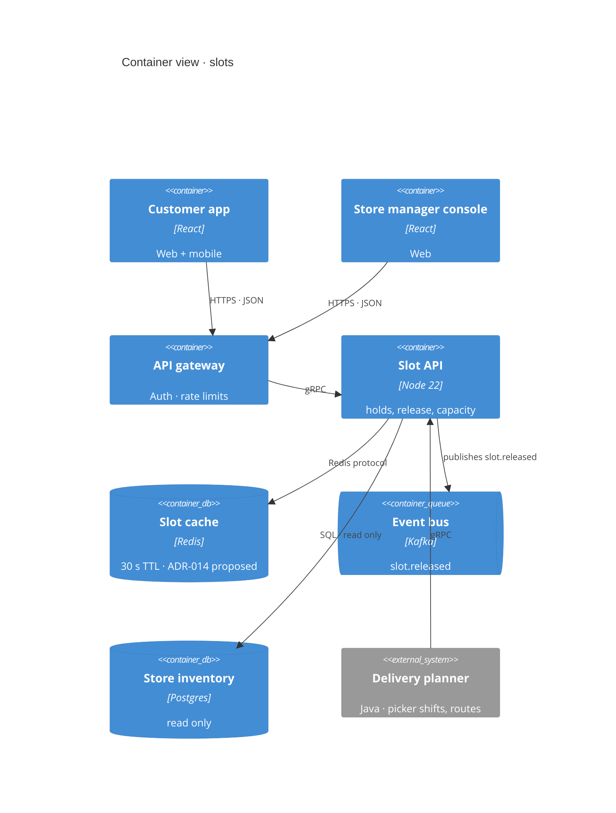

```mermaid
C4Container
title Container view · slots
Container(customerApp, "Customer app", "React", "Web + mobile")
Container(console, "Store manager console", "React", "Web")
Container(gateway, "API gateway", "", "Auth · rate limits")
Container(slotApi, "Slot API", "Node 22", "holds, release, capacity", $tags="new")
ContainerDb(slotCache, "Slot cache", "Redis", "30 s TTL · ADR-014 proposed", $tags="new")
ContainerQueue(eventBus, "Event bus", "Kafka", "slot.released")
ContainerDb(inventory, "Store inventory", "Postgres", "read only")
System_Ext(planner, "Delivery planner", "Java · picker shifts, routes")
Rel(customerApp, gateway, "HTTPS · JSON")
Rel(console, gateway, "HTTPS · JSON")
Rel(gateway, slotApi, "gRPC")
Rel(slotApi, slotCache, "Redis protocol")
Rel(slotApi, eventBus, "publishes slot.released")
Rel(slotApi, inventory, "SQL · read only")
Rel(planner, slotApi, "gRPC")
```
